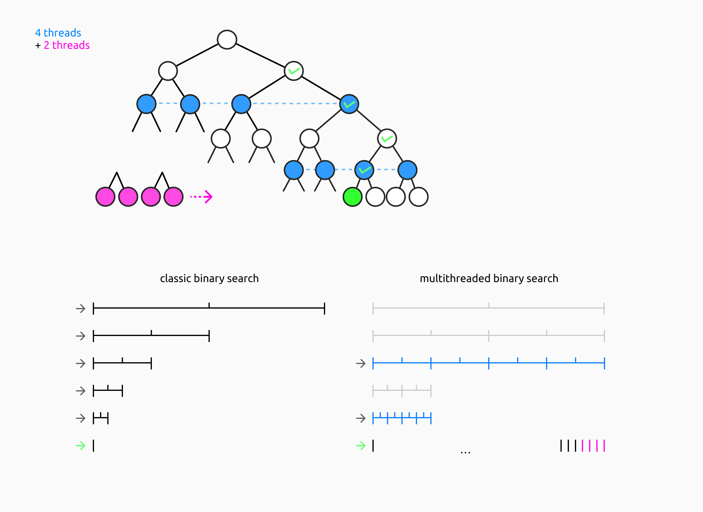

# Концепция параллельного бинарного поиска
Представим, что мы ищем число X в некотором диапазоне. Используя метод бинарного поиска для нахождения X, к примеру, нам потребуется выполнить 5 операций сравнения. \
Однако если учесть, что на текущий момент наши компьютеры умеют обрабатывать данные параллельно, распределяя нагрузку и сокращая время ожидания результата, мы можем подумать как воспользоваться этим для оптимизации бинарного поиска. \
На изображении ниже проиллюстрирована идея такой реализации на примере использования многопоточности; сверху поиск изображён в виде дерева. Имея всего 4 потока мы можем разделить имеющийся диапазон, в котором находится X, на 4 части, и за один такт выполнить сравнение для них всех — тем самым "перепрыгивая" через несколько узлов дерева (а то есть операций сравнения). Как только мы узнаём, что X содержится в диапазоне AB, который является 1/4 всего диапазона, то мы снова делим AB на 4 части и назначаем выполнение сравнений всем потокам, и так далее, пока не найдётся X. При таком методе вместо 5 сравнений мы производим всего 2.

Кроме того, имея больше сведений об X, мы можем ещё сильней оптимизировать этот алгоритм с помощью потоков. В описанном выше варианте мы производили сравнения сверху вниз, "перепрыгивая" через узлы дерева на такой уровень, на котором кол-во узлов равно кол-ву имеющихся потоков. Однако эти значения не обязаны быть равными. Имея 4 потока, мы можем разделить исходный диапазон на 8 частей, затем исполнив все 8 сравнений за 2 такта. Это ориентированный-на-везучесть метод поиска, который однако становится полезен, если, к примеру, нам известно, что X более вероятно имеет небольшое значение, хотя и не хотим исключать огромные. На рисунке ниже мы выделили 2 треда для поиска X на самом нижнем уровне дерева — то есть среди конечных значений.

**Note:** если мы ищем двоичным поиском номер символа в каком-то слове, то можно выделить несколько потоков на проверку значений наиболее часто используемых символов. Например, можно сразу проверить число 101, являющееся номером буквы "E", которая встречается в английских словах чаще всего.
